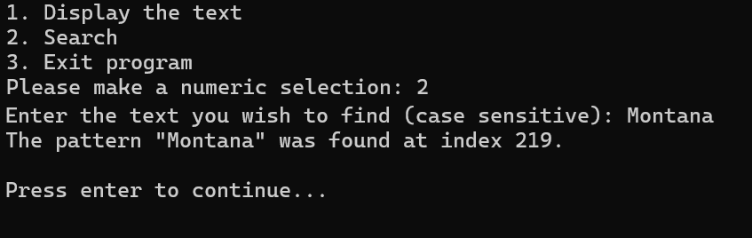

# Java-Boyer-Moore-Search

Boyer-Moore search algorithm in Java for Study.com CS:201 course. [Computer Science 201: Data Structures & Algorithms](https://study.com/academy/course/computer-science-201-data-structures.html)

## Program Specifications

#### The program specifications listed here are publicly available at [Study.com](https://study.com/academy/lesson/computer-science-201-assignment-2-searching-text-string-data.html)

- The application uses the names of 50 states in the United States as the input text.
- It uses the bad character rule of the Boyer-Moore algorithm to search the pattern a user inputs via an interface.
- When a user runs the application, it displays a menu and prompts the user to select an option.
- The menu options are:

1. Display the text
1. Search
1. Exit program

## Comments

The utterly insane amount of comments are required by the course rubric and are not reflective of my coding style.

## Demo Screenshots

## Building and Running

1. Clone the repository: `git clone https://github.com/AustinBachurski/Java-Boyer-Moore-Search.git`
1. Change to the source directory: `cd Java-Boyer-Moore-Search/src`
1. Compile the code and write files to an out directory: `javac -d out Main.java`
1. Change to the out directory: `cd out`
1. Run the application: `java Main`

## Additional Files

An `input.txt` file is included that contains the 50 US states as per the specified input text.
